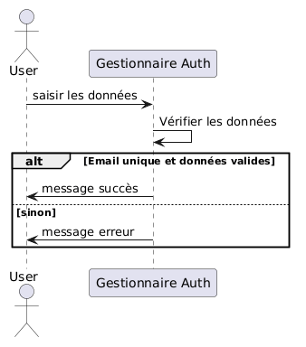
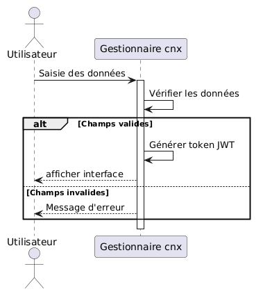
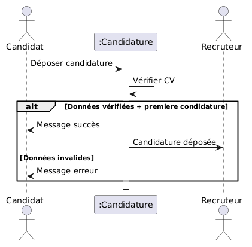
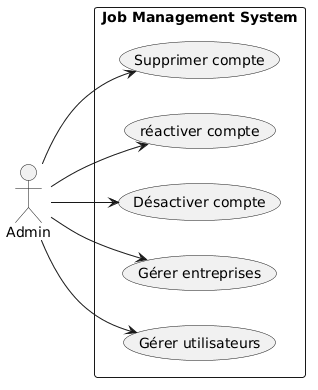
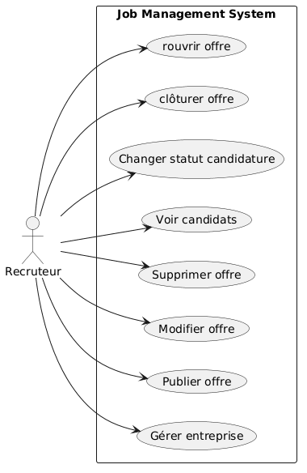
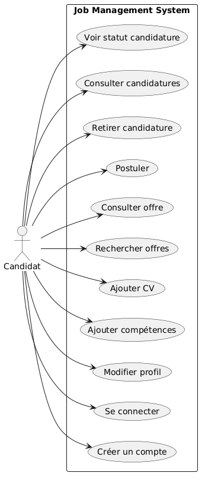
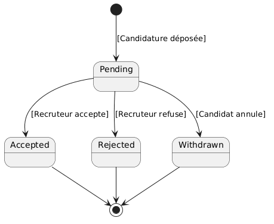
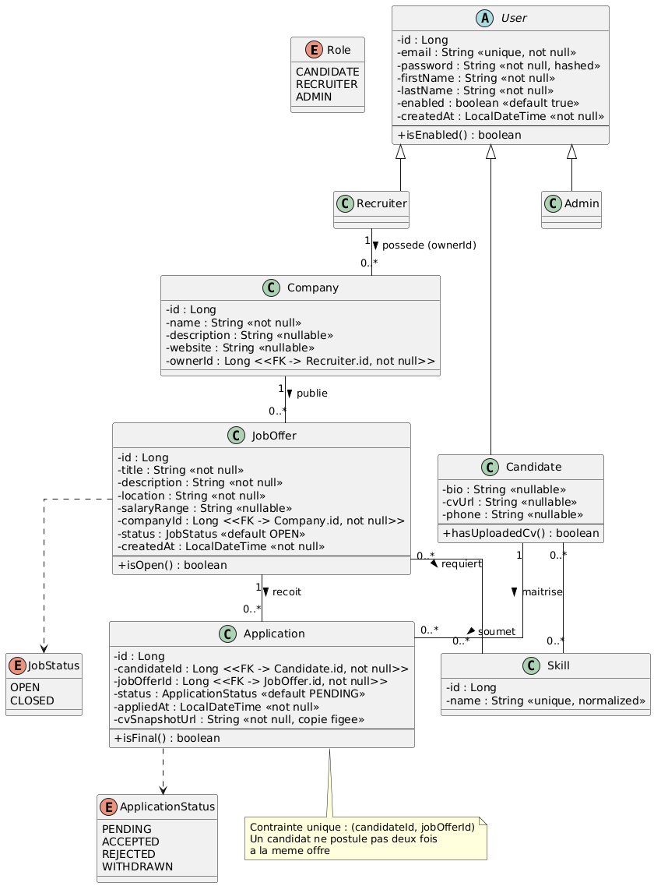

# modelisation — Job Management Platform

## les règles de gestion:
### 1. Utilisateurs (User)
- Email unique dans tout le système.
- Un compte = un seul rôle (CANDIDATE, RECRUITER ou ADMIN), pas de cumul.
- Mot de passe stocké hashé (BCrypt).
- Un compte a un statut `enabled = true/false` :
    - `true` → le compte peut se connecter et utiliser la plateforme.
    - `false` → le compte ne peut plus se connecter.
- Seul un ADMIN peut activer ou désactiver un compte, manuellement (pas de durée, pas d'automatisation).
- Un ADMIN peut supprimer un compte définitivement (voir règles de cascade en section 7).

### 2. Entreprise (Company)
- Un RECRUITER peut posséder plusieurs Company (relation 1-N User↔Company).
- La Company appartient au RECRUITER qui l'a créée (`ownerId`) — pas de rôle "propriétaire" séparé en v1.
- Seul le propriétaire (`ownerId`) ou un ADMIN peut modifier/supprimer une Company.
- Suppression d'une Company interdite si elle a des JobOffer actives (statut OPEN) liées ; il faut d'abord les clôturer.

### 3. Offre d'emploi (JobOffer)
- Un recruteur ne modifie/supprime que les offres liées à ses propres Company.
- Deux statuts possibles : OPEN et CLOSED.
- Transition libre dans les deux sens (OPEN → CLOSED et CLOSED → OPEN), tant que l'offre n'est pas supprimée.
- Une offre CLOSED :
    - N'apparaît pas dans les résultats de recherche/liste pour les utilisateurs standards (candidats).
    - Reste visible pour son propriétaire (recruteur) et pour les ADMIN, et peut être rouverte à tout moment.
- Une offre CLOSED n'accepte plus de nouvelles candidatures.
- Suppression physique interdite si des candidatures existent sur l'offre.
- Champs obligatoires à la création : `title`, `description`, `location`, `companyId`. `salaryRange` optionnel.

### 4. Compétences (Skill)
- Création et suppression libres par les candidats/recruteurs lors de l'ajout à leur profil/offre (pas de validation ADMIN).
- Saisie en texte libre (l'utilisateur tape le nom du skill au clavier, aucune contrainte de format imposée à la saisie).
- Standardisation faite côté backend (normalisation automatique, ex. trim des espaces, mise en forme uniforme) pour limiter les doublons, sans bloquer la saisie utilisateur.

### 5. Profil candidat (CandidateProfile)
- Créé automatiquement (vide) à l'inscription d'un CANDIDATE.
- Complété ensuite librement par l'utilisateur.
- Un candidat peut naviguer et consulter les offres sans profil complet.
- Le candidat upload son CV directement dans son profil ; ce CV est ensuite automatiquement associé/transmis à chaque candidature effectuée.

### 6. Candidature (Application)
- Contrainte unique (`candidateId`, `jobOfferId`) : impossible de postuler deux fois à la même offre.
- Un candidat doit avoir un CV uploadé dans son profil avant de pouvoir postuler.
- `cvSnapshotUrl` fige une copie du CV au moment de la candidature ; les modifications ultérieures du CV du candidat n'affectent pas les candidatures déjà envoyées.
- Retrait de candidature (statut → WITHDRAWN) possible uniquement si le statut actuel est PENDING.
- Transitions de statut autorisées :
    - PENDING → ACCEPTED (par le recruteur)
    - PENDING → REJECTED (par le recruteur)
    - PENDING → WITHDRAWN (par le candidat)
    - Aucune transition après ACCEPTED, REJECTED ou WITHDRAWN (statuts finaux, non réversibles).
- Un recruteur ne change le statut que des candidatures liées à ses propres offres.
- Le candidat peut suivre l'état de toutes ses candidatures depuis son espace.

### 7. Suppression d'un compte RECRUITER (cascade applicative)
Géré au niveau du Service (pas de cascade automatique en base de données), dans une transaction unique :
1. Récupération de toutes les Company du recruteur.
2. Récupération de toutes les JobOffer liées à ces Company.
3. Passage de toutes les Application liées à ces JobOffer au statut REJECTED.
4. Suppression des JobOffer.
5. Suppression des Company.
6. Suppression (ou désactivation définitive) du compte User du recruteur.

### 8. Règles transverses
- Toute modification/suppression vérifie la propriété de la ressource par l'utilisateur, sauf ADMIN (accès complet).
- Chaque endpoint sensible est testé avec un token du mauvais rôle → doit renvoyer 403 (vérifié au fil du développement, pas en fin de projet).
- Toute action métier significative (candidature reçue, statut changé) déclenche un email asynchrone, sans bloquer la réponse HTTP.
## diagrammes intérissants:

### diagrammes des séquences pour authentification:

### diagrammes des séquences pour la connexion:

### diagrammes des séquences pour la mise d'une condidature:

### diagrammes des cas d'utilsation:
### admin :

### recruteur :

### condidat :

### diagramme d'états de transition:

### diagramme des classes:

